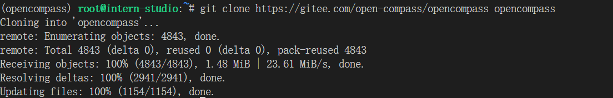
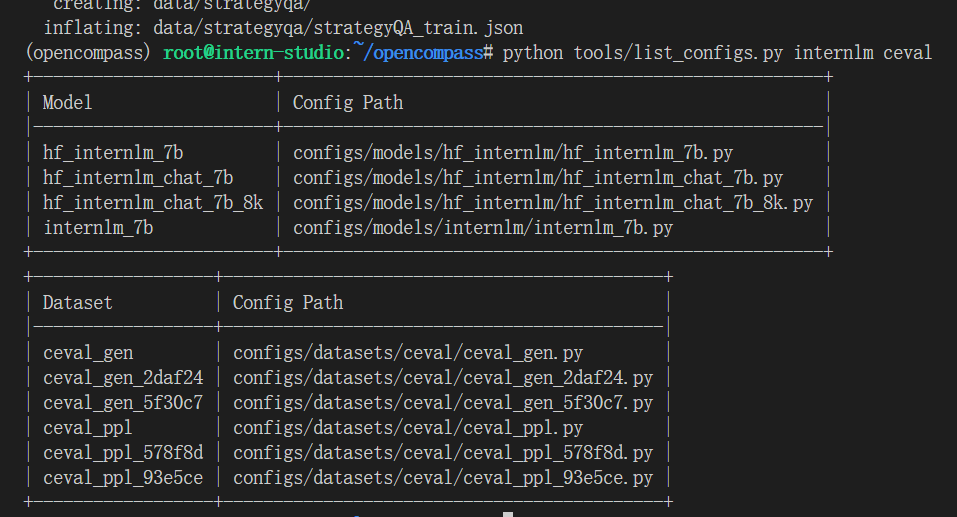
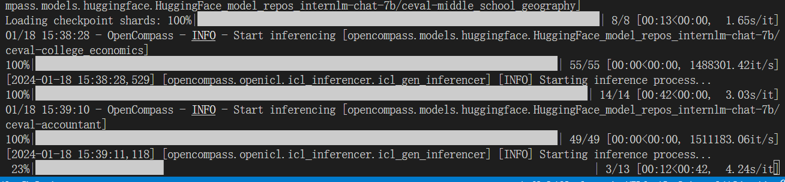
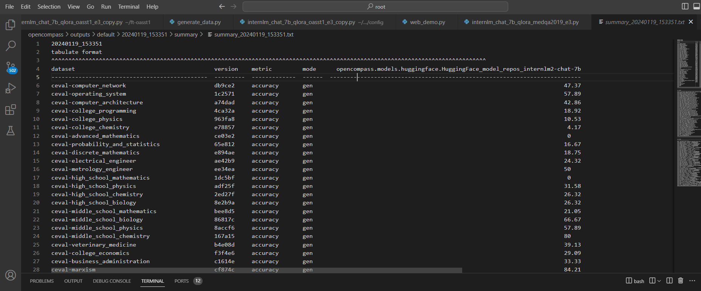

# 作业-OpenCompass
## 基础作业
使用 OpenCompass 评测 InternLM2-Chat-7B 模型在 C-Eval 数据集上的性能
安装：
下载的时候换源：

查看支持的数据集和模型：

启动评测：

显存不够，调小max-seq-len和batch-size
```bash
python run.py --datasets ceval_gen \
--hf-path /root/share/model_repos/internlm2-chat-7b/ \
--tokenizer-kwargs padding_side='left' truncation='left' \
trust_remote_code=True --model-kwargs trust_remote_code=True \
device_map='auto' --max-seq-len 1024 --max-out-len 16 --batch-size 2 --num-gpus 1
```
结果：


| Dataset                                         | Version | Metric         | Mode | opencompass.models.huggingface.HuggingFace_model_repos_internlm2-chat-7b |
|-------------------------------|---------|----------------|------|:---------------------------------|
| ceval-computer_network                          | db9ce2  | accuracy       | gen  | 47.37                                                                    |
| ceval-operating_system                          | 1c2571  | accuracy       | gen  | 57.89                                                                    |
| ceval-computer_architecture                     | a74dad  | accuracy       | gen  | 42.86                                                                    |
| ceval-college_programming                       | 4ca32a  | accuracy       | gen  | 18.92                                                                    |
| ceval-college_physics                           | 963fa8  | accuracy       | gen  | 10.53                                                                    |
| ceval-college_chemistry                         | e78857  | accuracy       | gen  | 4.17                                                                     |
| ceval-advanced_mathematics                      | ce03e2  | accuracy       | gen  | 0                                                                        |
| ceval-probability_and_statistics                | 65e812  | accuracy       | gen  | 16.67                                                                    |
| ceval-discrete_mathematics                      | e894ae  | accuracy       | gen  | 18.75                                                                    |
| ceval-electrical_engineer                       | ae42b9  | accuracy       | gen  | 24.32                                                                    |
| ceval-metrology_engineer                        | ee34ea  | accuracy       | gen  | 50                                                                       |
| ceval-high_school_mathematics                   | 1dc5bf  | accuracy       | gen  | 0                                                                        |
| ceval-high_school_physics                       | adf25f  | accuracy       | gen  | 31.58                                                                    |
| ceval-high_school_chemistry                     | 2ed27f  | accuracy       | gen  | 26.32                                                                    |
| ceval-high_school_biology                       | 8e2b9a  | accuracy       | gen  | 26.32                                                                    |
| ceval-middle_school_mathematics                 | bee8d5  | accuracy       | gen  | 21.05                                                                    |
| ceval-middle_school_biology                     | 86817c  | accuracy       | gen  | 66.67                                                                    |
| ceval-middle_school_physics                     | 8accf6  | accuracy       | gen  | 57.89                                                                    |
| ceval-middle_school_chemistry                   | 167a15  | accuracy       | gen  | 80                                                                       |
| ceval-veterinary_medicine                       | b4e08d  | accuracy       | gen  | 39.13                                                                    |
| ceval-college_economics                         | f3f4e6  | accuracy       | gen  | 29.09                                                                    |
| ceval-business_administration                   | c1614e  | accuracy       | gen  | 33.33                                                                    |
| ceval-marxism                                   | cf874c  | accuracy       | gen  | 84.21                                                                    |
| ceval-mao_zedong_thought                        | 51c7a4  | accuracy       | gen  | 70.83                                                                    |
| ceval-education_science                         | 591fee  | accuracy       | gen  | 62.07                                                                    |
| ceval-teacher_qualification                     | 4e4ced  | accuracy       | gen  | 75                                                                       |
| ceval-high_school_politics                      | 5c0de2  | accuracy       | gen  | 21.05                                                                    |
| ceval-high_school_geography                     | 865461  | accuracy       | gen  | 42.11                                                                    |
| ceval-middle_school_politics                    | 5be3e7  | accuracy       | gen  | 38.1                                                                     |
| ceval-middle_school_geography                   | 8a63be  | accuracy       | gen  | 50                                                                       |
| ceval-modern_chinese_history                    | fc01af  | accuracy       | gen  | 65.22                                                                    |
| ceval-ideological_and_moral_cultivation         | a2aa4a  | accuracy       | gen  | 89.47                                                                    |
| ceval-logic                                     | f5b022  | accuracy       | gen  | 9.09                                                                     |
| ceval-law                                       | a110a1  | accuracy       | gen  | 37.5                                                                     |
| ceval-chinese_language_and_literature           | 0f8b68  | accuracy       | gen  | 47.83                                                                    |
| ceval-art_studies                               | 2a1300  | accuracy       | gen  | 66.67                                                                    |
| ceval-professional_tour_guide                   | 4e673e  | accuracy       | gen  | 82.76                                                                    |
| ceval-legal_professional                        | ce8787  | accuracy       | gen  | 21.74                                                                    |
| ceval-high_school_chinese                       | 315705  | accuracy       | gen  | 21.05                                                                    |
| ceval-high_school_history                       | 7eb30a  | accuracy       | gen  | 70                                                                       |
| ceval-middle_school_history                     | 48ab4a  | accuracy       | gen  | 63.64                                                                    |
| ceval-civil_servant                             | 87d061  | accuracy       | gen  | 40.43                                                                    |
| ceval-sports_science                            | 70f27b  | accuracy       | gen  | 68.42                                                                    |
| ceval-plant_protection                          | 8941f9  | accuracy       | gen  | 72.73                                                                    |
| ceval-basic_medicine                            | c409d6  | accuracy       | gen  | 57.89                                                                    |
| ceval-clinical_medicine                         | 49e82d  | accuracy       | gen  | 45.45                                                                    |
| ceval-urban_and_rural_planner                   | 95b885  | accuracy       | gen  | 58.7                                                                     |
| ceval-accountant                                | 002837  | accuracy       | gen  | 34.69                                                                    |
| ceval-fire_engineer                             | bc23f5  | accuracy       | gen  | 12.9                                                                     |
| ceval-environmental_impact_assessment_engineer  | c64e2d  | accuracy       | gen  | 45.16                                                                    |
| ceval-tax_accountant                            | 3a5e3c  | accuracy       | gen  | 42.86                                                                    |
| ceval-physician                                 | 6e277d  | accuracy       | gen  | 51.02                                                                    |
| ceval-stem                                      | -       | naive_average  | gen  | 32.02                                                                    |
| ceval-social-science                            | -       | naive_average  | gen  | 50.58                                                                    |
| ceval-humanities                                | -       | naive_average  | gen  | 52.27                                                                    |
| ceval-other                                     | -       | naive_average  | gen  | 48.2                                                                     |
| ceval-hard                                      | -       | naive_average  | gen  | 13.5                                                                     |
| ceval                                           | -       | naive_average  | gen  | 43.3                                                                     |


